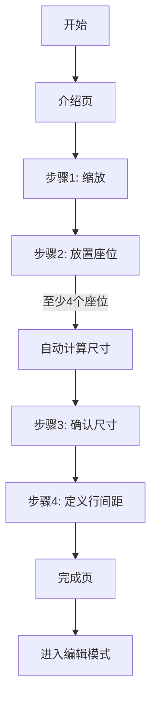

# seats.io 风格校准向导实现文档

## 概述

完整实现了 seats.io 的交互式校准流程，包括 6 个步骤的向导系统。

## 实现内容

### 1. 类型定义

**文件**: `app/src/types/calibration.ts`

定义了校准向导的核心类型：
- `CalibrationStep`: 校准步骤枚举
- `PlacedCalibrationSeat`: 放置的校准座位
- `CalibrationWizardState`: 向导状态

### 2. 向导步骤组件

所有组件位于 `app/src/components/section-edit/calibration-wizard/` 目录：

#### IntroStep.tsx
- 介绍页，显示校准向导说明
- 参照 seats.io 的 "Reference chart calibration" 页面

#### ZoomStep.tsx
- 步骤1：找到长排座位并放大
- 提供缩放级别控制（‹ 300% ›）
- 支持 Ctrl+滚轮和步进器缩放

#### PlaceSeatsStep.tsx
- 步骤2：在底图上放置座位
- 点击放置、拖拽移动、右键删除
- 实时调整座位尺寸
- 要求至少放置 4 个座位

#### AdjustSizeStep.tsx
- 步骤3：确认座位尺寸
- 自动计算最佳座位尺寸
- 用户可手动微调

#### SpacingStep.tsx
- 步骤4：定义行间距
- 显示操作说明和导航按钮

#### SpacingCanvas.tsx
- 专用于行间距定义的画布
- 自动识别第一排座位（Y坐标最小的一组）
- 保留原始第一排（半透明）
- 生成第一排的高亮副本（蓝色边框，可拖拽）
- 支持拖拽高亮副本到第二排位置
- 自动计算两排之间的距离作为行间距

#### CompleteStep.tsx
- 完成页，显示成功提示
- 点击完成进入编辑模式

### 3. 交互式画布

**文件**: `app/src/components/section-edit/calibration-wizard/InteractiveCalibrationCanvas.tsx`

核心功能：
- **点击放置座位**：在画布上点击放置虚拟座位
- **拖拽移动**：点击并拖拽调整座位位置
- **右键删除**：右键点击座位删除
- **缩放平移**：Ctrl+滚轮缩放，Space+拖拽平移
- **屏幕坐标转换**：自动转换屏幕坐标到世界坐标

### 4. 状态管理

**文件**: `app/src/hooks/useCalibrationWizard.ts`

提供完整的向导状态管理：
- `nextStep()` / `prevStep()`: 步骤导航
- `addPlacedSeat()` / `removePlacedSeat()`: 座位管理
- `updateSeatPosition()`: 更新座位位置
- `setCalculatedSize()` / `setConfirmedSize()`: 尺寸管理
- `setRowSpacing()`: 行间距管理
- **自动计算座位尺寸**：基于放置的座位间距自动计算

### 5. 重构 CalibrationMode

**文件**: `app/src/components/section-edit/CalibrationMode.tsx`

集成向导系统：
- 根据当前步骤渲染不同组件
- 管理向导状态和校准数据的同步
- 完成时保存最终校准参数

## 校准流程



## 交互细节

### 步骤1：缩放
- 鼠标移动：Space+拖拽平移画布
- 缩放：Ctrl+滚轮 或 步进器（‹ › 按钮）
- 目标：找到一排清晰的长座位

### 步骤2：放置座位
- 点击：在底图座位上放置虚拟座位
- 拖拽：点击并拖拽调整位置
- 右键：删除座位
- 实时调整：通过步进器调整座位尺寸
- 验证：至少放置 4 个座位才能继续

### 步骤3：确认尺寸
- 系统自动计算最佳座位尺寸（基于相邻座位间距）
- 显示推荐尺寸
- 用户可通过步进器微调

### 步骤4：定义行间距
- 系统自动识别第一排座位（Y坐标最小的一组）
- 保留原始第一排座位（半透明显示）
- 生成第一排的高亮副本（蓝色边框，可拖拽）
- 点击并拖拽高亮副本向下移动到第二排位置
- 系统自动计算两排之间的距离作为行间距
- 用于后续座位绘制

### 完成
- 保存所有校准参数
- 进入编辑模式，开始绘制座位

## 技术亮点

### 1. 坐标转换
```typescript
const screenToWorld = (screenX: number, screenY: number): Point => {
  const viewportX = screenX - rect.left + container.scrollLeft;
  const viewportY = screenY - rect.top + container.scrollTop;
  const worldX = (viewportX - (1 - canvasScale) * WORLD_CENTER) / canvasScale;
  const worldY = (viewportY - (1 - canvasScale) * WORLD_CENTER) / canvasScale;
  return { x: worldX, y: worldY };
};
```

### 2. 自动计算座位尺寸
```typescript
function calculateSeatSize(seats: PlacedCalibrationSeat[]): number {
  // 计算相邻座位的平均间距
  const distances = seats.map((s, i) => 
    i < seats.length - 1 ? distance(s, seats[i + 1]) : 0
  ).filter(d => d > 0);
  
  const avgDistance = average(distances);
  // 座位尺寸约为间距的 70%
  return Math.round(avgDistance * 0.7 * 10) / 10;
}
```

### 3. 拖拽实现
```typescript
// 记录拖拽偏移
const handleSeatMouseDown = (e, seatId, seat) => {
  const worldPos = screenToWorld(e.clientX, e.clientY);
  setDragOffset({
    x: worldPos.x - seat.x,
    y: worldPos.y - seat.y,
  });
};

// 拖拽移动
const handleMouseMove = (e) => {
  if (draggingSeatId && dragOffset) {
    const worldPos = screenToWorld(e.clientX, e.clientY);
    onUpdateSeatPosition(
      draggingSeatId,
      worldPos.x - dragOffset.x,
      worldPos.y - dragOffset.y
    );
  }
};
```

### 4. 识别第一排座位
```typescript
function identifyFirstRow(seats: PlacedCalibrationSeat[]): PlacedCalibrationSeat[] {
  // 按 Y 坐标排序
  const sorted = [...seats].sort((a, b) => a.y - b.y);
  
  // 找到第一排（Y坐标相近的座位）
  const firstY = sorted[0].y;
  const threshold = 50; // Y坐标差异阈值
  
  const firstRow = sorted.filter(seat => Math.abs(seat.y - firstY) < threshold);
  
  // 按 X 坐标排序
  return firstRow.sort((a, b) => a.x - b.x);
}
```

### 5. 拖拽整排定义行间距
```typescript
// 拖拽第一排
const handleRowMouseDown = (e) => {
  const worldPos = screenToWorld(e.clientX, e.clientY);
  setRowDragOffset(worldPos.y - currentRowOffset);
};

// 拖拽移动
const handleMouseMove = (e) => {
  if (isDraggingRow) {
    const worldPos = screenToWorld(e.clientX, e.clientY);
    const newOffset = worldPos.y - rowDragOffset;
    setCurrentRowOffset(newOffset);
  }
};

// 完成拖拽，计算行间距
const handleMouseUp = () => {
  if (isDraggingRow && currentRowOffset !== 0) {
    const spacing = Math.abs(currentRowOffset);
    onRowSpacingDefined(Math.round(spacing * 10) / 10);
  }
};
```

## 文件清单

| 文件路径 | 说明 |
|---------|------|
| `app/src/types/calibration.ts` | 校准类型定义 |
| `app/src/hooks/useCalibrationWizard.ts` | 向导状态管理 |
| `app/src/components/section-edit/calibration-wizard/IntroStep.tsx` | 介绍页 |
| `app/src/components/section-edit/calibration-wizard/ZoomStep.tsx` | 缩放步骤 |
| `app/src/components/section-edit/calibration-wizard/PlaceSeatsStep.tsx` | 放置座位步骤 |
| `app/src/components/section-edit/calibration-wizard/AdjustSizeStep.tsx` | 调整尺寸步骤 |
| `app/src/components/section-edit/calibration-wizard/SpacingStep.tsx` | 行间距步骤 |
| `app/src/components/section-edit/calibration-wizard/SpacingCanvas.tsx` | 行间距定义画布 |
| `app/src/components/section-edit/calibration-wizard/CompleteStep.tsx` | 完成页 |
| `app/src/components/section-edit/calibration-wizard/InteractiveCalibrationCanvas.tsx` | 交互式画布 |
| `app/src/components/section-edit/calibration-wizard/index.ts` | 组件导出 |
| `app/src/components/section-edit/CalibrationMode.tsx` | 重构后的校准模式容器 |

**统计**：12 个新文件，1 个重构文件

## 与 seats.io 的对比

| 功能 | seats.io | 本实现 | 状态 |
|------|----------|--------|------|
| 介绍页 | ✅ | ✅ | 完成 |
| 缩放控制 | ✅ | ✅ | 完成 |
| 点击放置座位 | ✅ | ✅ | 完成 |
| 拖拽移动座位 | ✅ | ✅ | 完成 |
| 右键删除座位 | ✅ | ✅ | 完成 |
| 实时调整尺寸 | ✅ | ✅ | 完成 |
| 自动计算尺寸 | ✅ | ✅ | 完成 |
| 定义行间距 | ✅ | ✅ | 完成 |
| 完成页 | ✅ | ✅ | 完成 |

## 后续优化建议

1. **视觉反馈**：添加更多动画和过渡效果
3. **错误处理**：添加异常情况的提示和恢复
4. **性能优化**：大量座位时的渲染优化
5. **撤销/重做**：支持操作历史管理

## 使用示例

```typescript
// 在 App.tsx 中使用
import { CalibrationMode } from '@/components/section-edit/CalibrationMode';

<CalibrationMode
  section={currentSection}
  svgUrl={backgroundImage}
  calibration={calibrationData}
  onCalibrationChange={handleCalibrationChange}
  onReset={handleReset}
  onComplete={handleComplete}
  onBack={handleBack}
/>
```

## 用户体验流程

### 步骤4：定义行间距的交互

1. **进入步骤4**：系统自动识别第一排座位（Y坐标最小的一组）
2. **视觉呈现**：
   - 原始第一排座位：半透明显示，固定在原位
   - 高亮副本：蓝色边框，叠加在原始位置上方
3. **拖拽操作**：
   - 鼠标悬停在高亮副本上，光标变为手型（grab）
   - 点击并向下拖拽高亮副本到第二排位置
   - 实时看到高亮副本移动
4. **计算行间距**：
   - 松开鼠标，系统计算：行间距 = |拖拽距离|
   - 保存行间距数据
5. **完成**：点击"下一步"进入完成页

### 视觉对比

| 元素 | 外观 | 行为 |
|------|------|------|
| 原始第一排 | 白色填充 + 区域颜色边框 + 50%透明度 | 固定位置，不可交互 |
| 高亮副本 | 白色填充 + 蓝色边框（3px） | 可拖拽，跟随鼠标移动 |
| 其他座位 | 白色填充 + 区域颜色边框 + 50%透明度 | 固定位置，不可交互 |

## 总结

完整实现了 seats.io 的交互式校准流程，提供了直观、易用的校准体验。用户可以通过交互式操作完成座位尺寸和间距的精确校准，为后续的座位绘制奠定基础。

**关键特性**：
- ✅ 6步向导流程
- ✅ 交互式座位放置和调整
- ✅ 自动计算座位尺寸
- ✅ 拖拽高亮副本定义行间距（与 seats.io 一致）
- ✅ 正方形座位 + pt 单位
- ✅ seats.io 风格的步进器控件
