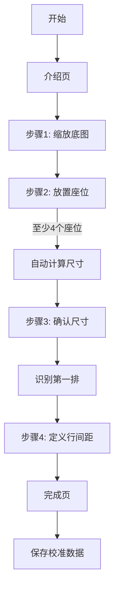

# 校准向导功能 - seats.io 风格实现

## 一、功能概述

实现完整的 seats.io 风格交互式校准向导，用于建立虚拟座位与底图实际座位之间的映射关系。

### 核心功能
- ✅ 6步交互式向导流程
- ✅ 点击放置座位、拖拽移动、右键删除
- ✅ 自动计算座位尺寸
- ✅ 拖拽定义行间距
- ✅ 正方形座位 + pt 单位
- ✅ seats.io 风格步进器控件

---

## 二、方案设计

### 2.1 校准流程



### 2.2 各步骤说明

#### 介绍页
- 显示校准向导说明
- 点击"下一步"开始

#### 步骤1：缩放底图
**目的**：找到底图上清晰的座位区域

**交互**：
- Ctrl+滚轮缩放
- 步进器控制：‹ 300% ›
- Space+拖拽平移画布

#### 步骤2：放置座位
**目的**：标记底图上的实际座位位置

**交互**：
- 点击：在底图座位上放置虚拟座位
- 拖拽：调整座位位置
- 右键：删除座位
- 步进器：实时调整座位尺寸

**验证**：至少放置 4 个座位

#### 步骤3：确认尺寸
**目的**：自动计算并确认最佳座位尺寸

**自动计算逻辑**：
```typescript
// 1. 计算相邻座位的平均间距
座位1 ←→ 座位2 ←→ 座位3 ←→ 座位4
  50px    50px    50px

平均间距 = 50px
座位尺寸 = 50px × 0.7 = 35px  // 座位约占间距的70%
```

**交互**：
- 显示计算结果："座位尺寸已自动调整"
- 用户可通过步进器微调

#### 步骤4：定义行间距
**目的**：确定上下两排座位的垂直距离

**自动识别第一排**：
```typescript
// 1. 按 Y 坐标排序
// 2. 找到 Y 坐标最小的一组（阈值 50px）
// 3. 按 X 坐标排序
```

**交互**：
```
原始第一排：  ▢ ▢ ▢ ▢ ▢  （半透明，固定位置）
                ↓ 拖拽
高亮副本：    ▣ ▣ ▣ ▣ ▣  （蓝色边框，可拖拽）
                ↓
第二排位置：  ▢ ▢ ▢ ▢ ▢  （目标位置）

行间距 = 高亮副本Y - 原始第一排Y
```

**视觉效果**：
- 原始第一排：白色填充 + 区域颜色边框 + 50%透明度（固定）
- 高亮副本：白色填充 + 蓝色边框（可拖拽）
- 其他座位：白色填充 + 区域颜色边框 + 50%透明度

#### 完成页
- 显示成功图标（绿色对勾）
- "参考图已校准"
- 点击"完成"保存校准数据并进入编辑模式

---

## 三、技术架构

### 3.1 类型定义

```typescript
// app/src/types/calibration.ts

// 校准步骤
export type CalibrationStep =
  | 'intro'        // 介绍页
  | 'zoom'         // 步骤1：缩放
  | 'place'        // 步骤2：放置座位
  | 'adjust'       // 步骤3：调整尺寸
  | 'spacing'      // 步骤4：定义行间距
  | 'complete';    // 完成

// 放置的校准座位
export interface PlacedCalibrationSeat {
  id: string;
  x: number;
  y: number;
}

// 校准向导状态
export interface CalibrationWizardState {
  currentStep: CalibrationStep;
  placedSeats: PlacedCalibrationSeat[];
  calculatedSize: number | null;
  confirmedSize: number | null;
  firstRow: PlacedCalibrationSeat[] | null;
  secondRow: PlacedCalibrationSeat[] | null;
  calculatedRowSpacing: number | null;
}

// 座位视觉参数（正方形座位）
export interface SeatVisualParams {
  size: number;   // 座位边长 (pt)
  gapX: number;   // 横向间距 (pt)
  gapY: number;   // 纵向间距 (pt)
}

// 校准数据
export interface CalibrationData {
  canvasScale: number;
  anchorScale: number;
  seatVisual: SeatVisualParams;
  isCalibrated: boolean;
}
```

### 3.2 组件架构

```
CalibrationMode (容器)
├── IntroStep (介绍页)
├── ZoomStep (步骤1)
│   └── InteractiveCalibrationCanvas
├── PlaceSeatsStep (步骤2)
│   └── InteractiveCalibrationCanvas
│       ├── 点击放置座位
│       ├── 拖拽移动座位
│       └── 右键删除座位
├── AdjustSizeStep (步骤3)
│   └── InteractiveCalibrationCanvas
├── SpacingStep (步骤4)
│   └── SpacingCanvas
│       ├── 显示原始第一排（固定）
│       ├── 显示高亮副本（可拖拽）
│       └── 计算行间距
└── CompleteStep (完成页)
```

### 3.3 状态管理

```typescript
// app/src/hooks/useCalibrationWizard.ts

export function useCalibrationWizard() {
  const [state, setState] = useState<CalibrationWizardState>({
    currentStep: 'intro',
    placedSeats: [],
    calculatedSize: null,
    confirmedSize: null,
    firstRow: null,
    secondRow: null,
    calculatedRowSpacing: null,
  });

  // 步骤导航
  const nextStep = useCallback(() => {
    // 从 place 进入 adjust 时，自动计算座位尺寸
    if (currentStep === 'place' && nextStep === 'adjust') {
      const calculatedSize = calculateSeatSize(placedSeats);
      return { calculatedSize, confirmedSize: calculatedSize };
    }
    
    // 从 adjust 进入 spacing 时，识别第一排
    if (currentStep === 'adjust' && nextStep === 'spacing') {
      const firstRow = identifyFirstRow(placedSeats);
      return { firstRow };
    }
  }, []);

  return {
    state,
    nextStep,
    prevStep,
    addPlacedSeat,
    removePlacedSeat,
    updateSeatPosition,
    setConfirmedSize,
    setRowSpacing,
  };
}
```

---

## 四、核心算法

### 4.1 坐标转换

```typescript
// 屏幕坐标 → 世界坐标
const screenToWorld = (screenX: number, screenY: number): Point => {
  const container = containerRef.current;
  const rect = container.getBoundingClientRect();
  
  // 1. 屏幕坐标 → 视口坐标
  const viewportX = screenX - rect.left + container.scrollLeft;
  const viewportY = screenY - rect.top + container.scrollTop;
  
  // 2. 视口坐标 → 世界坐标
  const worldX = (viewportX - (1 - canvasScale) * WORLD_CENTER) / canvasScale;
  const worldY = (viewportY - (1 - canvasScale) * WORLD_CENTER) / canvasScale;
  
  return { x: worldX, y: worldY };
};
```

### 4.2 自动计算座位尺寸

```typescript
function calculateSeatSize(seats: PlacedCalibrationSeat[]): number {
  if (seats.length < 2) return 20;
  
  // 1. 计算相邻座位的距离
  const distances: number[] = [];
  for (let i = 0; i < seats.length - 1; i++) {
    const dx = seats[i + 1].x - seats[i].x;
    const dy = seats[i + 1].y - seats[i].y;
    const distance = Math.sqrt(dx * dx + dy * dy);
    distances.push(distance);
  }
  
  // 2. 计算平均距离
  const avgDistance = distances.reduce((sum, d) => sum + d, 0) / distances.length;
  
  // 3. 座位尺寸约为间距的 70%
  const calculatedSize = avgDistance * 0.7;
  
  return Math.round(calculatedSize * 10) / 10;
}
```

### 4.3 识别第一排座位

```typescript
function identifyFirstRow(seats: PlacedCalibrationSeat[]): PlacedCalibrationSeat[] {
  if (seats.length === 0) return [];
  
  // 1. 按 Y 坐标排序
  const sorted = [...seats].sort((a, b) => a.y - b.y);
  
  // 2. 找到 Y 坐标最小的一组（阈值 50px）
  const firstY = sorted[0].y;
  const threshold = 50;
  const firstRow = sorted.filter(seat => Math.abs(seat.y - firstY) < threshold);
  
  // 3. 按 X 坐标排序
  return firstRow.sort((a, b) => a.x - b.x);
}
```

### 4.4 拖拽交互

**单个座位拖拽**：
```typescript
// 1. 记录拖拽偏移
const handleSeatMouseDown = (e, seatId, seat) => {
  const worldPos = screenToWorld(e.clientX, e.clientY);
  setDragOffset({
    x: worldPos.x - seat.x,
    y: worldPos.y - seat.y,
  });
  setDraggingSeatId(seatId);
};

// 2. 拖拽移动
const handleMouseMove = (e) => {
  if (draggingSeatId && dragOffset) {
    const worldPos = screenToWorld(e.clientX, e.clientY);
    onUpdateSeatPosition(
      draggingSeatId,
      worldPos.x - dragOffset.x,
      worldPos.y - dragOffset.y
    );
  }
};
```

**整排拖拽**：
```typescript
// 1. 记录拖拽偏移
const handleRowMouseDown = (e) => {
  const worldPos = screenToWorld(e.clientX, e.clientY);
  setRowDragOffset(worldPos.y - currentRowOffset);
  setIsDraggingRow(true);
};

// 2. 拖拽移动
const handleMouseMove = (e) => {
  if (isDraggingRow) {
    const worldPos = screenToWorld(e.clientX, e.clientY);
    setCurrentRowOffset(worldPos.y - rowDragOffset);
  }
};

// 3. 完成拖拽，计算行间距
const handleMouseUp = () => {
  if (isDraggingRow && currentRowOffset !== 0) {
    const spacing = Math.abs(currentRowOffset);
    onRowSpacingDefined(Math.round(spacing * 10) / 10);
  }
};
```

---

## 五、文件结构

### 5.1 新建文件（12个）

```
app/src/
├── types/
│   └── calibration.ts                    # 校准类型定义
├── hooks/
│   └── useCalibrationWizard.ts           # 向导状态管理
└── components/section-edit/
    ├── CalibrationMode.tsx               # 重构为向导容器
    └── calibration-wizard/
        ├── index.ts                      # 组件导出
        ├── IntroStep.tsx                 # 介绍页
        ├── ZoomStep.tsx                  # 步骤1：缩放
        ├── PlaceSeatsStep.tsx            # 步骤2：放置座位
        ├── AdjustSizeStep.tsx            # 步骤3：确认尺寸
        ├── SpacingStep.tsx               # 步骤4：行间距说明
        ├── SpacingCanvas.tsx             # 步骤4：行间距画布
        ├── CompleteStep.tsx              # 完成页
        └── InteractiveCalibrationCanvas.tsx  # 交互式画布
```

### 5.2 修改文件（6个）

```
app/src/
├── types/
│   └── index.ts                          # 修改 SeatVisualParams，导出校准类型
├── hooks/
│   └── useSectionEdit.ts                 # 更新默认校准数据
└── components/section-edit/
    ├── SeatPreview.tsx                   # 使用 size 替代 width/height
    ├── CalibrationPanel.tsx              # 重写为步进器风格
    └── CalibrationCanvas.tsx             # 添加悬停检测
```

---

## 六、UI 设计

### 6.1 步进器控件

```tsx
// seats.io 风格步进器
<div className="flex items-center border rounded">
  <button onClick={decrease}>‹</button>
  <span>{value} pt</span>
  <button onClick={increase}>›</button>
</div>
```

**应用场景**：
- 画布缩放：‹ 300% ›
- 座位尺寸：‹ 35 pt ›
- 横向间距：‹ 15 pt ›
- 纵向间距：‹ 25 pt ›

### 6.2 步骤指示器

```tsx
// 顶部说明栏
<div className="bg-white border-b shadow-sm p-4">
  <div className="flex items-start gap-3">
    <div className="w-10 h-10 rounded-full bg-gray-900 text-white">
      1
    </div>
    <div>
      <h2>找到一排长座位并放大</h2>
      <p>点击并拖拽移动画布。使用底部控件或 Ctrl+滚轮缩放。</p>
    </div>
  </div>
</div>
```

### 6.3 底部控制栏

```tsx
// 导航按钮
<div className="bg-white border-t shadow-lg p-6">
  <div className="flex items-center justify-between">
    <Button variant="ghost" onClick={onBack}>
      ‹ 返回
    </Button>
    <Button onClick={onNext}>
      下一步 ›
    </Button>
  </div>
</div>
```

---

## 七、使用示例

```typescript
// 在 App.tsx 中使用
import { CalibrationMode } from '@/components/section-edit/CalibrationMode';

<CalibrationMode
  section={currentSection}
  svgUrl={backgroundImage}
  calibration={calibrationData}
  onCalibrationChange={handleCalibrationChange}
  onReset={handleReset}
  onComplete={handleComplete}
  onBack={handleBack}
/>
```

---

## 八、校准的作用

### 8.1 核心作用

建立虚拟座位坐标系统与底图实际座位之间的映射关系。

### 8.2 确定的参数

通过校准，系统获得：
- **座位尺寸**：`size = 35pt`
- **横向间距**：`gapX = 15pt`
- **纵向间距**：`gapY = 25pt`
- **画布缩放**：`canvasScale = 3.0`

### 8.3 实际应用

**场景**：体育馆座位图

```
底图（实际照片）：
┌─────────────────────────────┐
│  [座位][座位][座位][座位]   │  ← 底图上的座位
│  [座位][座位][座位][座位]   │
└─────────────────────────────┘

校准后（虚拟座位精确覆盖）：
┌─────────────────────────────┐
│  [▣][▣][▣][▣]              │  ← 虚拟座位对齐底图
│  [▣][▣][▣][▣]              │
└─────────────────────────────┘
```

### 8.4 后续好处

**1. 精确绘制**
```typescript
// 系统知道参数，可以快速绘制矩阵座位
for (let row = 0; row < 10; row++) {
  for (let col = 0; col < 20; col++) {
    座位位置 = {
      x: startX + col * (size + gapX),
      y: startY + row * (size + gapY)
    }
  }
}
```

**2. 容量估算**
```typescript
区域宽度 = 1000px
区域高度 = 800px

每列宽度 = size + gapX = 35 + 15 = 50px
每行高度 = size + gapY = 35 + 25 = 60px

列数 = 1000 / 50 = 20列
行数 = 800 / 60 = 13行

总容量 = 20 × 13 = 260座位
```

**3. 批量操作**
- 矩阵工具：一次绘制整块座位
- 单排工具：快速绘制一排座位
- 所有座位自动对齐底图

---

## 九、与 seats.io 的对比

| 功能 | seats.io | 本实现 | 状态 |
|------|----------|--------|------|
| 介绍页 | ✅ | ✅ | 完成 |
| 缩放控制 | ✅ | ✅ | 完成 |
| 点击放置座位 | ✅ | ✅ | 完成 |
| 拖拽移动座位 | ✅ | ✅ | 完成 |
| 右键删除座位 | ✅ | ✅ | 完成 |
| 实时调整尺寸 | ✅ | ✅ | 完成 |
| 自动计算尺寸 | ✅ | ✅ | 完成 |
| 拖拽定义行间距 | ✅ | ✅ | 完成 |
| 两排显示（原始+高亮） | ✅ | ✅ | 完成 |
| 完成页 | ✅ | ✅ | 完成 |
| 步进器控件风格 | ✅ | ✅ | 完成 |
| pt 单位 | ✅ | ✅ | 完成 |

**结论**：完全实现 seats.io 的校准流程，功能对等。

---

## 十、总结

### 实现成果

✅ 完整实现 seats.io 风格的交互式校准向导  
✅ 6步向导流程，用户体验流畅  
✅ 交互式放置和调整座位  
✅ 自动计算座位尺寸和行间距  
✅ 正方形座位 + pt 单位  
✅ seats.io 风格的步进器控件  
✅ 拖拽高亮副本定义行间距  

### 技术亮点

- 精确的坐标转换系统
- 智能的自动计算算法
- 流畅的拖拽交互
- 模块化的向导架构
- 完整的状态管理

### 代码质量

- 所有代码通过 linter 检查
- 类型定义完整
- 组件职责清晰
- 易于维护和扩展

---

**文档版本**：v1.0  
**创建日期**：2026-02-26  
**状态**：已完成
